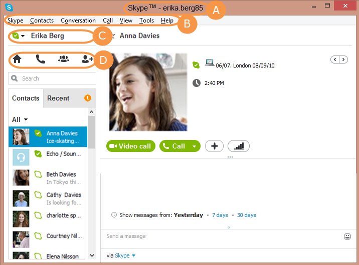
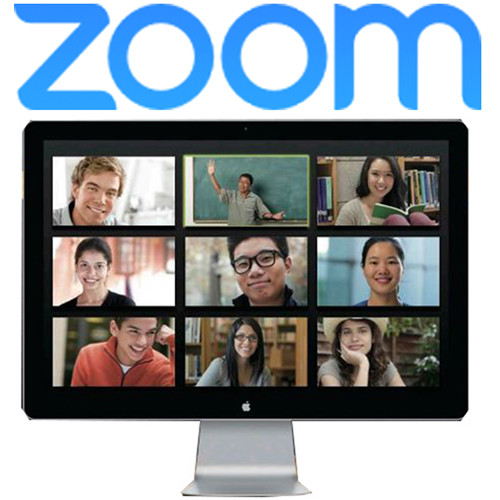
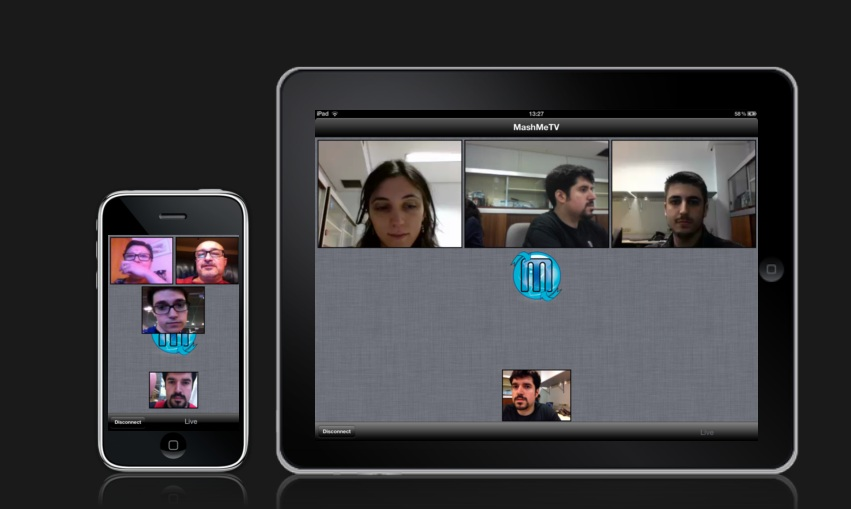

## Posibles escenarios

Los escenarios que se contemplan son los siguientes

- uno a uno
- uno a muchos

## Aspectos técnicos y operativos

- Software
- Equipos
- Red (LAN y WAN)

## Software

Algunos softs para cada escenario

## Propósito general

## Skype

## Características

- https://skype.com
- uno a uno
- hasta 5 participantes en la versión gratis (verificar)
- permite compartir el escritorio
- PC: se instala o se puede usar vía web (beta)
- Tablet/Smartphone (android, IOS)
- ampliamente usado (gran cant. de usuarios)

## Wire

- https://wire.com
- uno a uno
- vía web
- Tablet/Smartphone (android, IOS)

## Diseñadas para cursos, clases

## Zoom

## Características

- https://zoom.us
- Versión gratis limitada (duración, cant. usuarios)

## mashme

## Características

- https://mashme.io

## Youtube / Hangouts

Características

- 
